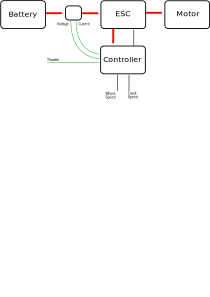

# Design Overview
- Battery: Turnigy 4x 6S 8mAh LiPo
- Motor: Turnigy Aerodrive SK3-6354
- ESC: Hobbywing SkyWalker UBEC 80A
- Controller: Arduino Nano
- Sensors
  - Potentiometer for Throttle
  - Hall Effect Switch & Small Magnets for wheel speed
  - Hall Effect Switch & Small Magnets for crank speed
  - Voltage Divider for Low Battery Voltage Cutout
  - Hall Effect Current Sensor for Stall Cutout

